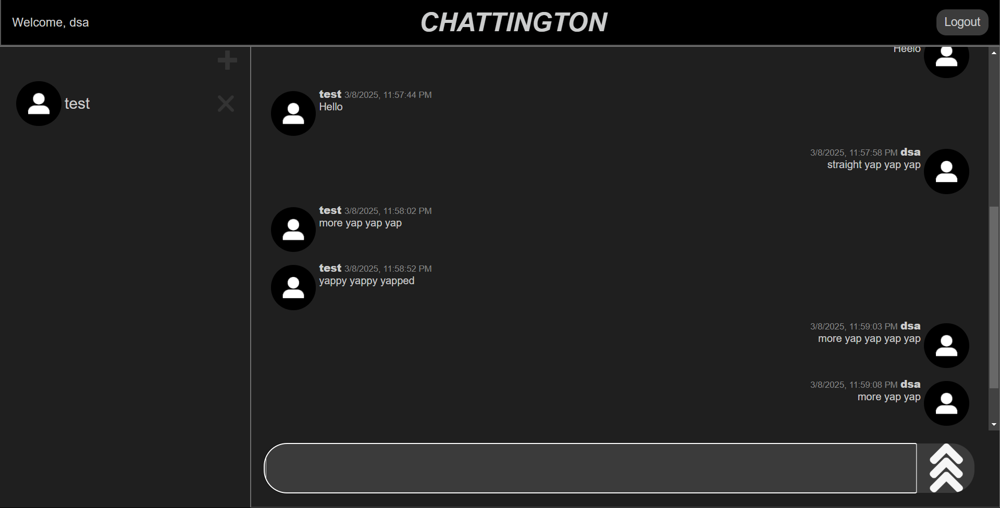

# Chattington 💬

Chattington is a real-time chat application that leverages WebSockets and RESTful APIs to enable instant messaging, friend management, and message editing/deletion. Built with Node.js, Express, and vanilla JavaScript, it provides a seamless and responsive chatting experience.

 

## Features ✨

- **Real-time Messaging**: Instant message delivery using WebSockets.
- **User Authentication**: Secure login/signup with session management.
- **Friend Management**: Add or unfriend users.
- **Message Operations**: Edit or delete sent messages in real-time.
- **History Sync**: Load past messages when switching chat channels.
- **Responsive UI**: Clean and intuitive interface for seamless interaction.

## Technologies 🛠️

- **Backend**: Node.js, Express, MySQL
- **Frontend**: Vanilla JavaScript, WebSockets
- **Database**: MySQL (hosted on Railway)
- **Authentication**: Express sessions, cookie-based
- **Environment Management**: `dotenv`

## Installation 👥

1. **Clone the repository**:
   ```bash
   git clone https://github.com/allonnnnnnn/Chattington.git
   cd Chattington
   ```

2. **Install dependencies**:
   ```bash
   npm install express mysql2 dotenv express-session ws crypto
   ```

3. **Database Setup**:
   - Create a MySQL database (e.g., railway).
   - Create tables for user, friendship, channel, and message (see Database Schema).

4. **Environment Variables**:
   - Create a `.env` file in the root directory:
     ```env
     DBHOST=your_database_host
     DBPASSWORD=your_database_password
     ```

5. **Run the server**:
   ```bash
   node index.js
   ```
   Access the app at `http://localhost:8000`.

## Database Schema 💃📛

```sql
-- Example schema (adjust based on your actual table structures)
CREATE TABLE user (
  id INT AUTO_INCREMENT PRIMARY KEY,
  email VARCHAR(255) UNIQUE NOT NULL,
  name VARCHAR(255) NOT NULL,
  password VARCHAR(255) NOT NULL
);

CREATE TABLE friendship (
  id INT AUTO_INCREMENT PRIMARY KEY,
  user1Id INT NOT NULL,
  user2Id INT NOT NULL,
  FOREIGN KEY (user1Id) REFERENCES user(id),
  FOREIGN KEY (user2Id) REFERENCES user(id)
);

CREATE TABLE channel (
  id INT AUTO_INCREMENT PRIMARY KEY,
  user1Id INT NOT NULL,
  user2Id INT NOT NULL,
  FOREIGN KEY (user1Id) REFERENCES user(id),
  FOREIGN KEY (user2Id) REFERENCES user(id)
);

CREATE TABLE message (
  id INT AUTO_INCREMENT PRIMARY KEY,
  userId INT NOT NULL,
  channelId INT NOT NULL,
  message TEXT NOT NULL,
  date DATETIME NOT NULL,
  FOREIGN KEY (userId) REFERENCES user(id),
  FOREIGN KEY (channelId) REFERENCES channel(id)
);
```

## API Endpoints 🌐

| Method | Endpoint             | Description          |
|--------|----------------------|----------------------|
| POST   | `/login`             | User login          |
| POST   | `/createNewAccount`  | Create a new account |
| POST   | `/addFriend`         | Add a friend by email |
| DELETE | `/deleteFriendship`  | Remove a friend |
| PUT    | `/updateMessage`     | Edit a message |
| DELETE | `/deleteMessage`     | Delete a message |
| GET    | `/getFriendships`    | Fetch all friends |
| GET    | `/getChannelId`      | Get current chat channel ID |

## Contributing 🤝

1. Fork the repository.
2. Create a feature branch:
   ```bash
   git checkout -b feature/new-feature
   ```
3. Commit changes:
   ```bash
   git commit -m "Add new feature"
   ```
4. Push to the branch:
   ```bash
   git push origin feature/new-feature
   ```
5. Submit a pull request.

## License 📚

MIT License. See `LICENSE` for details.
